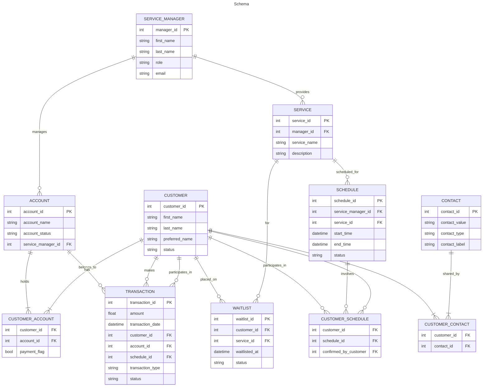

## Business Use Case: Service and Account Management

### 1. Account Management:
The **Account** entity represents an account that can have **multiple customers** associated with it. Each **Account** is managed by a **Service Manager**. The **Service Manager** is responsible for overseeing the services provided to customers, including scheduling, pricing, and handling payments.

#### Use Case:
- **Service Manager** creates an **Account** for customers, assigns a **Service Manager** to that account, and manages the account's status (active, inactive, etc.).
- Customers can be linked to multiple **Accounts** and can share the account with other customers.
- Each **Account** can track its customers' eligibility to make payments via a **payment_flag** in the **Customer_Account** table.

---

### 2. Customer Management:
A **Customer** represents a person who participates in services (like painting, lawn services, lessons, etc.). Customers can belong to one or more **Accounts**. They can be associated with multiple **Contacts** (phone numbers, emails, etc.) and track their status (e.g., active, waitlisted, inactive).

#### Use Case:
- **Customer** information such as **first name**, **last name**, **preferred name**, and **status** is tracked in the system.
- A **Customer** can belong to one **Accounts**, and the **Customer_Account** table ensures the **Account**-**Customer** relationship is maintained.
- A **Customer** can belong to many **Accounts** as owner to make transactions and view balances.
- TBA: A **Customer** may opt out of using the **web console** or may share **Contacts** with other customers within the same **Account**.

---

### 3. Service Scheduling:
The **Schedule** represents a scheduled service (e.g., a **tennis lesson**, **group lesson**, or **consultation**) for a **Customer**. A **Service Manager** assigns the **Service** and **Schedule** to customers, ensuring that the lessons are managed effectively and that the correct **service_id** and **schedule_id** are used.

#### Use Case:
- **Service Manager** creates a **Schedule** for a **Customer** with a **Service** type (e.g., private lesson or group class).
- The **Schedule** includes **start time**, **end time**, and **status** (e.g., scheduled, completed, or canceled).
- Multiple customers can be scheduled for a single **Service**, and each customer in the **Schedule** has the option to confirm their participation.

---

### 4. Payments and Transactions:
**Transactions** track payments, charges, and deposits related to **Accounts** and **Schedules**. The **Customer** makes a **payment** for a **charge** (such as a **tennis lesson**), and this payment is linked to the **Account** and the **Schedule** via the **Transaction** entity.

#### Use Case:
- **Service Manager** can create a **charge** in the **Transaction** table when a **Service** is performed.
- **Customer** can make a **deposit** to their **Account**, which will be credited as a **deposit transaction**.
- The **Customer** can make payments for a service once a charge has been applied. The **transaction_type** field in the **Transaction** table tracks whether a transaction is a **deposit**, **charge**, or **payment**.
- The **Transaction** is linked to the **Account** and **Schedule** (so the **Service Manager** knows which service the payment applies to).

---

### 5. Waitlist Management:
Customers who cannot be immediately scheduled for a service can be placed on a **Waitlist** for a particular **Service**. The **Waitlist** tracks the **Customer**, **Service**, and the **date they were placed on the waitlist**.

#### Use Case:
- **Customer** is placed on the **Waitlist** for a **Service** when they are not able to book a **Schedule** immediately (for example, if a **group lesson** is full).
- The **Waitlist** records the **customer_id**, **service_id**, and **waitlisted_at** timestamp, allowing the **Service Manager** to easily manage and prioritize customers for future scheduling.

---

### 6. Confirmation of Participation:
A **Customer** confirms their participation in a **Schedule**. This confirmation is tracked using the **Customer_Schedule** table, which indicates whether the **Customer** has confirmed their participation in a scheduled service.

#### Use Case:
- **Customer** confirms their participation for a scheduled **Service** in the **Schedule**.
- Confirmation is linked to the **Customer_Schedule** table through **confirmed_by_customer**. This ensures that only confirmed customers will be considered for the service and can be charged accordingly.

---

### 7. Contact Information:
**Contact** entities store the different ways customers can be reached, such as **email**, **phone number**, or other means of communication. Each **Customer** can have multiple **Contacts** associated with them.

#### Use Case:
- **Customer** can have multiple **Contacts**, and each contact is categorized with **contact_type** (e.g., phone, email) and **contact_label** (e.g., primary, secondary).
- The system tracks the **Contact** information in the **CUSTOMER_CONTACT** table, allowing for easy retrieval and communication.

---

### 8. Service Management:
The **Service Manager** is responsible for overseeing and scheduling various **Services**. Each **Service** is linked to a **Service Manager** and has a defined **price**, **description**, and **duration**. The **Service Manager** assigns and tracks **Services** to customers.

#### Use Case:
- **Service Manager** is responsible for creating, managing, and providing **Services** such as **tennis lessons**, **group lessons**, or **consultations**.
- **Service Manager** schedules a **Service** for **Customers**, and the service is tracked with relevant details (e.g., **service_id**, **duration**, **price**).
- As the **Service Manager** provides the **Service**, transactions and schedules are created and linked to **Customers**.

## Schema Diagram

## Supported Logins
Google Sign-In, Facebook Login, Apple Sign-In, Microsoft Login, Anonymous Authentication.